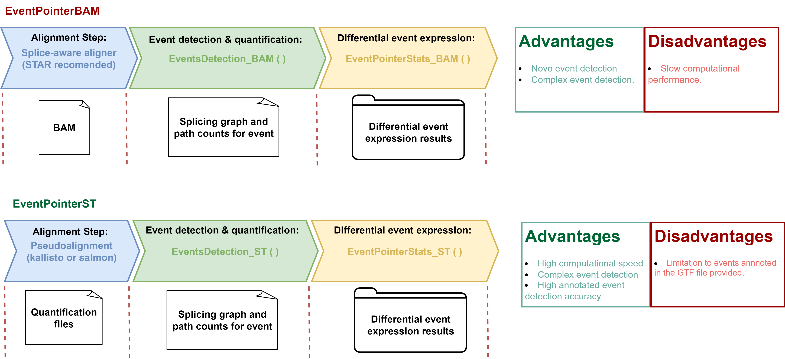
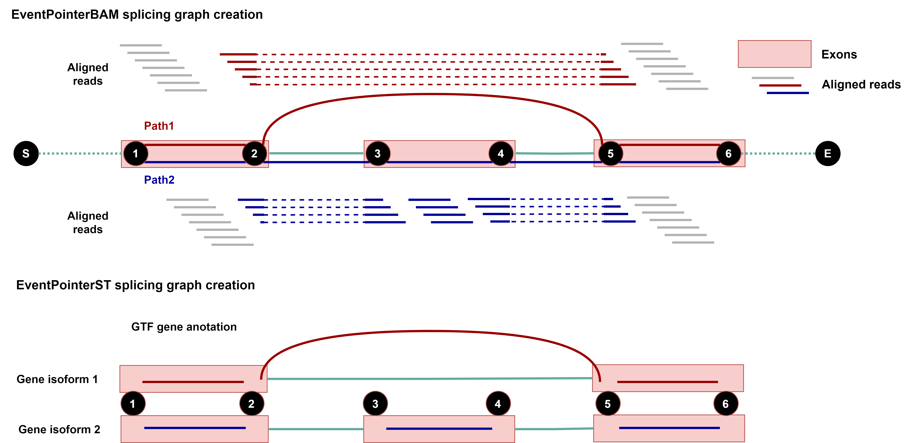
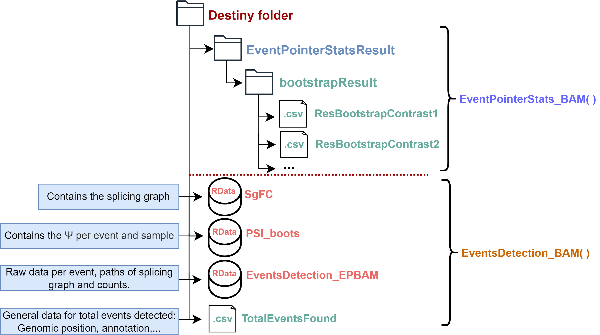
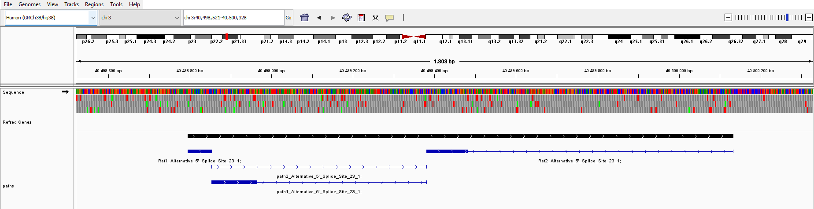
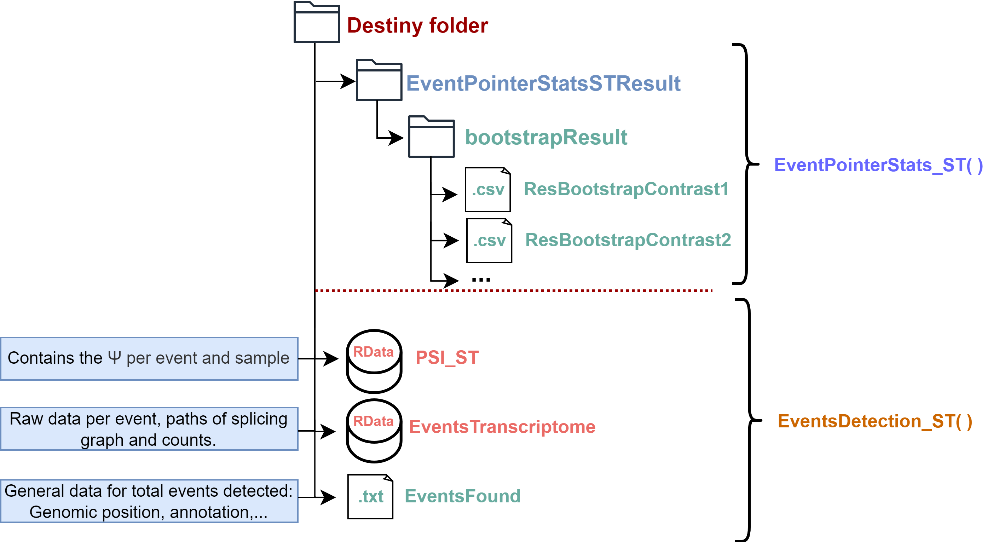

```{r LoadFunctions, echo=FALSE, message=FALSE, warning=FALSE, results='hide'}
library(knitr)
opts_chunk$set(error = FALSE)
library(dplyr)
library(kableExtra)
```

```{r style, echo = FALSE, results = 'asis'}
##BiocStyle::markdown()
```

# Installation

EventPointer can be installed from Bioconductor using the BiocManager
package:

```{r, eval=FALSE}

library(BiocManager)

if (!requireNamespace("BiocManager", quietly=TRUE))
    install.packages("BiocManager")

BiocManager::install("EventPointer")
```

# Introduction

The *EventPointer* R package provides users with a simplified method to
identify, classify, and visualize alternative splicing events using
RNA-seq data. There are two types of workflows to follow using
EventPointer, both aiming for the same objective but employing different
approaches to achieve it:

-   *EventPointerBAM (EP_BAM)* The initial files for this workflow are
    the BAM files resulting from the alignment of RNA-seq sequences. The
    alignment should be performed using a splice-aware aligner
    (recommended example: STAR). From these files, the detection,
    classification, and quantification of splicing events are carried
    out. The main advantage of this methodology is its ability to detect
    de novo events based on the alignment of reads.

-   *EventPointerST (EP_ST)* In this case, the detection and
    classification of events are determined by the corresponding
    transcriptome annotation in GTF format. The quantification files of
    transcripts come from pseudoaligners (examples: salmon and
    kallisto).

To simplify the overall analysis procedure of alternative splicing for
the user, we have divided each workflow of the two approaches (EP_BAM
and EP_ST) into two steps. One part involves the detection, cataloging,
and calculation of the Percent Spliced In (PSI) of events, and the other
involves the statistical analysis related to the calculation of the PSI
increment between conditions. 


Both approaches share a common element within their respective workflows: the creation of a splicing graph. EventPointerBAM creates the splicing graph from aligned reads using aligners sensitive to junction reads (e.g., STAR). In contrast, EventPointerST utilizes the existing annotations of exons from each gene's isoforms to create the splicing graph, thus requiring only the relative abundances of these isoforms for its workflow.


# EventPointerBAM

The aim of EventPointerBAM is to perform detection, classification,
quantification and differential analysis between conditions using as
input data sequence alignments of RNA-seq data performed using aligners
sensitive to junction reads. *Advantages: De novo event detection.*
*Disadvantages: Higher computational cost. More sensitive to sequencing
and alignment errors.*

## EventsDetection_BAM()

This function is responsible for the detection of events from the input
alignment files, their classification and the calculation of the
associated PSI. The required input for the function is described below:

-   **PathSamplesAbundance** : Path to bam files or path to folder with
    bam files.

-   **PathTranscriptomeGTF**: Path to the trascriptome annotation in GTF
    format.

### *Detection parameters*:

-   **min_junction_count** : Minimum fragment count required for a
    splice junction to be included in the splicing gaph.
-   **max_complexity**: Maximum allowed complexity. If a locus exceeds
    this threshold, it is skipped, resulting in a warning. Complexity is
    defined as the maximum number of unique predicted splice junctions
    overlapping a given position. High complexity regions are often due
    to spurious read alignments and can slow down processing.
-   **region**: Numerical vector indicating the regions (at the
    chromosomal level) to be used for event searching.

### *PSI calculation parameters*:

-   **nboot**: Number of resamples of the quantification of the samples
    to perform bootstrap.
-   **lambda**:

### *Performance & results parameters*:

-   **cores**: Nº of cores used for the function.
-   **AnnEvetns**: Boolean parameter indicating whether or not to
    perform the annotation process on the events to classify them as
    possible novo. (This process can take some time)
-   **PathSGResult**: Folder where save the function result.  $\Psi$ and
    splicing graph objects in RData format.

Using EventsDetection_BAM function:

```{r, eval=FALSE, warning=FALSE, collapse=TRUE}

PathSamplesAbundance <- system.file("extdata/bams", package = "EventPointer")

PathTranscriptomeGTF <- list.files(PathSamplesAbundance,"*.gtf",full.names = T)

PathSGResult <- tempdir()
EventsDetection_BAM(PathSamplesAbundance, PathTranscriptomeGTF, 
                                      cores = 9, region=16, AnnEvents=T,
                                      min_junction_count = 5, max_complexity = 50,
                                      PathSGResult = PathSGResult)

```

## EventPointerStats_BAM()

This function performs the differential comparison between sample groups for the calculation of delta PSI.

### *Parameters*:

-   **Design**: A matrix defining the linear model. Each row corresponds
    to an array, and each column corresponds to a coefficient (such as
    the baseline and treatment effects).
-   **Contrast**: A numeric matrix with contrasts to be tested. Rows
    correspond to coefficients in the design matrix, and columns
    correspond to contrasts.
-   **Threshold**: it assigns a threshold to compute the pvalues.
    Default = 0
-   **UseBootstrap**: Boolean variable to indicate if bootstrap step in
    $\Psi$ is applicated.
-   **nbootstraps**: How many layers, Bootstraps or samplings are going
    to be used. Caution, high numbers increase computational time.
-   **cores**: The number of cores desired to use.
-   **pathResult**: Folder where save the function result.

### *Command example*:

```{r, eval=FALSE, warning=FALSE, collapse=TRUE}
data(PSI_boots)
#Creation of design matrix
Design <- cbind(rep(1,9),
                 rep(c(1,0,0),3),
                 rep(c(0,1,0),3))
#Creation of contrast matrix
Contrast <- cbind(
  c(0,1,0),
  c(0,0,1))

EventPointerStats_BAM(PSI_boots, Design, Contrast, cores=8, UseBootstrap=F,
                  Threshold = 0, nbootstraps = 1000, pathResult = PathSGResult)

```

### *Result format*:

The following table shows an example of the results associated with the differential $\Psi$ analysis of the indicated comparisons performed by the EventPointerStats_BAM() function. It presents the $\Delta \Psi$ associated with each event of that contrast and its corresponding significance parameters.

```{r EP_BAM_RES_TABLE,eval=FALSE, echo=FALSE}
tableContrast1 <- read.csv(paste0(PathSGResult,"/EventPointerStatsResult/bootstrapResult/ResBootstrapContrast1.csv"),row.names = 1)
kable(tableContrast1[1:5,],digits=5,row.names=TRUE,align="c",caption = "Table 1: EventPointerBAM results")
```

Obtendremos una tabla como la mostrada por cada contraste indicado en
nuestra matriz de contraste. El sistema de archivos resultante tanto de
la funcion `EventPointerStats_BAM()` y `EventsDetection_BAM()` será el
siguiente: 


## IGV visualization

The alternative splicing events detected by EventPointerBAM can be
visualized using the `EventPointerBAM_IGV()` function. This function
displays the paths that make up the splicing graph of each event in a
gtf format that can be viewed using the IGV program. Each event is
composed of 3 paths: path1, path2, and Reference, which will be
indicated along with the event id for identification as "path1\_",
"path2\_", "Ref_1", and "Ref_2".



To create the GTF files, the algorithm uses the `EventPointerBAM_IGV()`
function with the following parameters:

-   **SG_RNASeq**: Data.frame generated by EventPointer with the events
    to be included in the GTF file.
-   **EventsTxt**: Reference transcriprome. Must be one of: "Ensembl",
    "UCSC" , "AffyGTF" or "CustomGTF".
-   **PathGTF**: If input is "AffyGTF" or "CustomGTF", inputFile should
    point to the GTF file to be used.

```{r, eval=FALSE, collapse=TRUE}
EventsTxt<-paste(system.file("extdata",package="EventPointer"),"/TotalEventsFound.csv",sep="")
load(paste(system.file("extdata",package="EventPointer"),"/SgFC.RData",sep=""))
SG_RNASeq <- SgFC
PathGTF <- tempdir()
EventPointerBAM_IGV(SG_RNASeq, EventsTxt, PathGTF)
```

Once the process is completed one GTF file is generated in the specified
directory.

# EventPointerST

Similar to EventPointerBAM, the aim of EventPointerST is to perform detection, classification, quantification, and differential analysis between conditions using RNA-seq sequence alignments as input data. However, the method employed for this purpose relies on previously known and annotated events provided in a GTF annotation format. Therefore, the preliminary sequence alignment step is carried out using pseudoaligners that depend on transcript annotations for the assignment of relative abundances. Limiting the identification to annotated events significantly increases the computational speed of the algorithm and makes it more transferable across different RNA-seq sequencing runs, as the detected events are not dependent on the sequencing itself but on the previously provided annotations for initial event identification. Pre-identification of events based on annotation prevents sequencing noise from affecting identification, thereby reducing false positives.

## EventsDetection_ST()

The `EventsDetection_ST()` function represents the initial step in the
EventPointerST workflow. Similar to EventPointerBAM, this function is
responsible for creating the splicing graph, identifying events, and
obtaining the  $\Psi$ from abundance data. In this case, by basing the
identification of events on the annotation, we can provide data from
previously detected events to avoid the steps of splicing graph
generation and event identification for an annotation that has already
been used.

```{r, eval=F}
PathFiles<-system.file("extdata",package="EventPointer")
PathTranscriptomeGTF <- paste(PathFiles,"/gencode.v24.ann_2genes.gtf",sep="")
PathSamplesAbundance <- paste0(PathFiles,"/output")
PathSamplesAbundance <- dir(PathSamplesAbundance,full.names = TRUE)
Pathtxt <- tempdir()
EventsPSI <- EventsDetection_ST(PathSamplesAbundance,PathTranscriptomeGTF = PathTranscriptomeGTF,
                                PathEventsGTFResults=Pathtxt,
                                cores=1, typeAbundance = "kallisto", Bootstrap=T, Filter=F,
                                Qn = 0.25)
```

### *Parameters*:

-   **PathSamplesAbundance**: Path to quantification data of gene
    isoforms obtained from the corresponding pseudoaligner.
-   **PathTranscriptomeGTF**: Path to gene annotation GTF file.
-   **EventsTranscriptome**: Events detected from a previos
    identification from a GTF.
-   **PathEventsGTFResults:** Path where the detected event data from a
    GTF file and the  $\Psi$ results will be generated.
-   **Bootstrap:** Boolean indicating whether to perform the PSI
    bootstrap.
-   **typeAbundance:** Type of abundance files provided for the PSI analysis. The options are "salmon" or "kallisto".
-   **Filter:** Boolean variable to indicate if an expression filter is applied. Default FALSE.
-   **Qn:** Quantile used to filter the events (Bounded between 0-1, Q1
    would be 0.25).

## EventPointerStats_ST()

This function performs the differential comparison between sample groups for the calculation of delta PSI.

### *Parameters*:

-   **PSI**: RData variable resulting  from EventsDetection_ST()
-   **Design**: A matrix defining the linear model. Each row corresponds
    to an array, and each column corresponds to a coefficient (such as
    the baseline and treatment effects).
-   **Contrast**: A numeric matrix with contrasts to be tested. Rows
    correspond to coefficients in the design matrix, and columns
    correspond to contrasts.
-   **BootstrapStats**: Boolean variable to indicate if bootstrap step in PSI is applicated.
-   **PSI**: RData variable resulting  from EventsDetection_ST()
-   **UsePseudoAligBootstrap**: TRUE (default) if bootstrap data from pseudoaligment want to be used or FALSE if not.
-   **nbootstraps**: How many layers, Bootstraps or samplings are going
    to be used. Caution, high numbers increase computational time.
-   **cores**: The number of cores desired to use.
-   **pathResult**: Folder where save the function result.

### *Command example*:

```{r, eval=FALSE, warning=FALSE, collapse=TRUE}
data(PSI_boots)
#Creation of design matrix
Design <- cbind(1,rep(c(0,1),each=2))
#Creation of contrast matrix
Contrast <- matrix(c(0,1),nrow=2)

pathResult <- tempdir()
EventPointerStats_ST(PSI, Design, Contrast, cores=1, 
                                 BootstrapStats = T,nbootstraps= 10000, 
                                 UsePseudoAligBootstrap = T,Threshold = 0,
                                 pathResult=pathResult)

```

The output format of the event table resulting from the EventPointerStats_ST() function is similar to that of its counterpart in EventPointerBAM. The structure of the folder containing the complete workflow results is as follows:



# References

-   Ferrer-Bonsoms, Juan A., et al. "EventPointer 3.0: flexible and accurate splicing analysis that includes studying the differential usage of protein-domains" NAR Genomics and Bioinformatics
    4,3 (2022).
-   Romero, Juan P., et al. "Comparison of RNA-seq and microarray
    platforms for splice event detection using a cross-platform
    algorithm." BMC genomics 19.1 (2018): 703.
-   Goldstein, Leonard D., et al. "Prediction and Quantification of
    Splice Events from RNA-Seq Data." PloS one 11.5 (2016): e0156132.
-   Seshagiri, Somasekar, Eric W Stawiski, Steffen Durinck, Zora
    Modrusan, Elaine E Storm, Caitlin B Conboy, Subhra Chaudhuri, et
    al. 2012. "Recurrent R-spondin fusions in colon cancer." Nature 488
    (7413): 660--64. \*Untergasser, A., Cutcutache, I., Koressaar, T.,
    Ye, J., Faircloth, B. C., Remm, M., & Rozen, S. G. (n.d.).
    Primer3-new capabilities and interfaces.
    <https://doi.org/10.1093/nar/gks596>

# Session Information

```{r}
sessionInfo()
```
