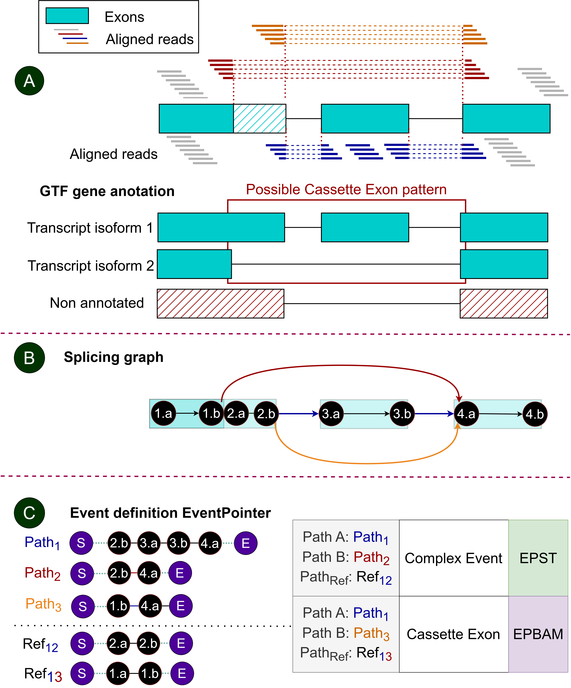
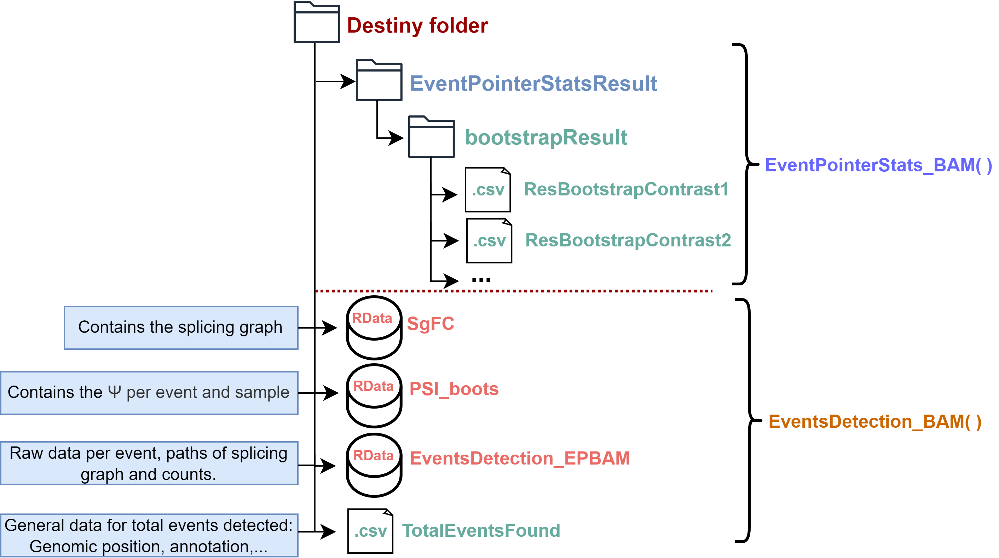
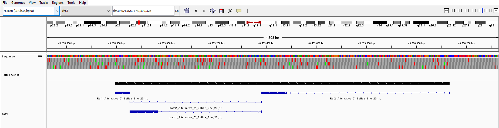
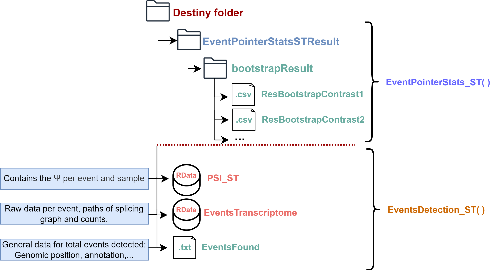

```{r LoadFunctions, echo=FALSE, message=FALSE, warning=FALSE, results='hide'}
library(knitr)
opts_chunk$set(error = FALSE)
library(dplyr)
library(kableExtra)
```

```{r style, echo = FALSE, results = 'asis'}
##BiocStyle::markdown()
```


# Installation

EventPointer can be installed from Bioconductor using the BiocManager package:

```{r, eval=FALSE}

library(BiocManager)

if (!requireNamespace("BiocManager", quietly=TRUE))
    install.packages("BiocManager")

BiocManager::install("EventPointer")
```


# Introduction

*EventPointer* R package provides users with a simplified method to identify, classify, and visualize alternative splicing events using RNA-seq data. It is possible to follow two different workflows with EventPointer, both aiming for the same objective but employing different approaches to achieve it:

* **EventPointerBAM (EP_BAM)**: The detection, classification and quantification of splicing events is carried out using the BAM files generated from RNA-seq sequence alignment. It should be noted that the alignment must be performed using an aligner that takes splicing into account (recommended tool: STAR). The main advantage of this methodology is its ability to detect de novo events based on reads alignment. 

* **EventPointerST (EP_ST)**: The detection and classification of events are determined by the corresponding transcriptome annotation in GTF format. In this case, the quantification files of transcripts come from pseudoaligners (examples: salmon or kallisto).

To simplify the overall analysis procedure of alternative splicing for the user, we have divided each workflow (EP_BAM and EP_ST) in two steps as shown in Figure 1. One part involves the detection, classification, and calculation of the Percent Spliced In (PSI) of events, and the other consists of the statistical analysis of the calculation of the PSI increment between conditions. 


Figure 2 shows the process of identification and classification of events in each workflow and it can be seen that both approaches share a common element: the creation of a splicing graph. However, *EventPointerBAM* creates the splicing graph from aligned reads using aligners sensitive to junction reads (e.g., STAR). In contrast, *EventPointerST* uses the existing annotations of exons from each gene's isoforms to create the splicing graph, thus requiring only the relative abundances of these isoforms for its workflow.




# EventPointerBAM

The aim of EventPointerBAM is to perform detection, classification, quantification and differential analysis between conditions, using as input data sequence alignments of RNA-seq data performed using aligners sensitive to junction reads. 


## EventsDetection_BAM()

This function is responsible for the detection of events from the input alignment files, their classification and the calculation of the associated PSI. The inputs for the function are described below:


### *Bams and GTF file parameters*

* **PathSamplesAbundance**: Path to bam and bai files or path to folder with bam and bai files.

* **PathTranscriptomeGTF**: Path to file containing the regions to be analysed from the bam files in GTF format.


### *Detection parameters*

* **region**: Numerical vector indicating the index of positions (at chromosomal level) to be analysed from the GTF. Default value is NULL so that all regions are analysed. 

* **min_junction_count**: Minimum number of junctions detected in the alignment to be considered in the splicing graph. Default value is 2. 

* **max_complexity**: Maximum allowed complexity. If a locus exceeds this threshold, it is skipped, resulting in a warning. Complexity is defined as the maximum number of unique predicted splice junctions overlapping a given position. High complexity regions are often due to spurious read alignments and can slow down processing. Default value is 30. 

* **min_n_sample**: Minimum number of samples that a junction must have to be considered. Default value is 3.

* **min_anchor**: Minimum number of aligned bases at one end of an exon to consider a junction. Default value is 6. 


### *PSI calculation parameters*

* **nboot**: Number of resamples of the quantification of the samples to perform bootstrap. Default value is 20. 

* **lambda**:


### *Performance parameters*

* **cores**: Nº of cores used for the function. Default value is 1. 


### *Results parameters*

* **PathSGResult**: Path where to save the following 4 files: 

  * **TotalEventsFound.csv**: General data for total events detected in csv format. 
  * **EventsDetection_EPBAM.RData**: Raw data per event, paths of splicing graph and counts in RData format. 
  * **SgFC.RData**: Contains the splicing graph in RData format.
  * **PSI_boots.RData**: $\Psi$ per event and sample in RData format.


### *Command example*

Using `EventsDetection_BAM` function:

```{r, eval=FALSE, warning=FALSE, collapse=TRUE}

PathSamplesAbundance <- system.file("extdata/bams", package = "EventPointer")
PathTranscriptomeGTF <- list.files(PathSamplesAbundance,"*.gtf",full.names = T)

PathSGResult <- tempdir()

EventsDetection_BAM(PathSamplesAbundance, 
                    PathTranscriptomeGTF, 
                    region = 16,
                    min_junction_count = 2, 
                    max_complexity = 30,
                    min_n_sample = NULL,
                    min_anchor = 6,
                    nboot = 20,
                    lambda = NULL,
                    cores = 1,
                    PathSGResult = PathSGResult)

```


## EventPointerStats_BAM()

This function performs the differential comparison between sample groups for the calculation of delta PSI. The inputs for the function are described below:


### *Statistical analysis parameters*

* **PSI_boots**: *PSI_boots.RData* obtained in `EventsDetection_BAM` function. 

* **Design**: A matrix defining the linear model. Each row corresponds to an array, and each column corresponds to a coefficient (such as the baseline and treatment effects).

* **Contrast**: A numeric matrix with contrasts to be tested. Rows correspond to coefficients in the design matrix, and columns correspond to contrasts.

* **Threshold**: It assigns a threshold to compute the p-values. Default value is 0. 

* **nbootstraps**: How many layers, Bootstraps or samplings are going to be used. Caution, high numbers increase computational time.


### *Performance parameters*

* **cores**: The number of cores desired to use.


### *Results parameters*

* **pathResult**: Folder where to save the result that consists of a table with the results associated with the differential $\Psi$ analysis of the indicated contrasts. It presents the $\Delta \Psi$ associated with each events of that contrast and its corresponding significance parameters. Note that a table will be obtained for each contrast indicated in contrast matrix. 


### *Command example*

```{r, eval=FALSE, warning=FALSE, collapse=TRUE}

data(PSI_boots)

Design <- cbind(rep(1,9),rep(c(1,0,0),3),rep(c(0,1,0),3))
Contrast <- cbind(c(0,1,0),c(0,0,1))

EventPointerStats_BAM(PSI_boots, 
                      Design, 
                      Contrast, 
                      Threshold = 0,
                      nbootstraps = 1000,
                      cores=1, 
                      ram = 0.1, 
                      pathResult = PathSGResult)

```


## Summary

When running both `EventsDetection_BAM()` and `EventPointerStats_BAM()`, the resulting files at the defined output folder will be those shown in Figure 3. 




## IGV visualization

Alternative splicing events detected by EventPointerBAM can be visualized using the `EventPointerBAM_IGV()` function as shown in Figure 4. This function displays the paths that make up the splicing graph of each event in a gtf format that can be viewed using the IGV program. Each event is composed of 3 paths: path1, path2, and Reference, which will be indicated along with the event id for identification as "path1\_", "path2\_", "Ref_1", and "Ref_2".



To create the GTF files, the algorithm uses the `EventPointerBAM_IGV()` function with the following parameters:


### *Events and reference transcriptome parameters*

* **SG_RNASeq**: Data.frame generated by `EventsDetection_BAM` with the events to be included in the GTF file.
* **EventsTxt**: Reference transcriptome. Must be one of: "Ensembl", "UCSC", "AffyGTF" or "CustomGTF".


### *Results parameters*

* **PathGTF**: Folder where to save the generated GTF file. 

```{r, eval=FALSE, collapse=TRUE}

EventsTxt<-paste(system.file("extdata",package="EventPointer"),"/TotalEventsFound.csv",sep="")
load(paste(system.file("extdata",package="EventPointer"),"/SgFC.RData",sep=""))
SG_RNASeq <- SgFC
PathGTF <- tempdir()

EventPointerBAM_IGV(SG_RNASeq, 
                    EventsTxt, 
                    PathGTF)
```


# EventPointerST

Similar to EventPointerBAM, the aim of EventPointerST is to perform detection, classification, quantification, and differential analysis between conditions using RNA-seq sequence alignments as input data. However, the method employed for this purpose relies on previously known and annotated events provided in a GTF annotation format. Therefore, the preliminary sequence alignment step is carried out using pseudoaligners that depend on transcript annotations for the assignment of relative abundances. Limiting the identification to annotated events significantly increases the computational speed of the algorithm and makes it more transferable across different RNA-seq sequencing runs, as the detected events are not dependent on the sequencing itself but on the previously provided annotations for initial event identification. Pre-identification of events based on annotation prevents sequencing noise from affecting identification, thereby reducing false positives.


## EventsDetection_ST()

The `EventsDetection_ST()` function represents the initial step in the EventPointerST workflow. Similar to EventPointerBAM, this function is responsible for creating the splicing graph, identifying events, and obtaining the $\Psi$ from abundance data. In this case, as event identification is based on the annotation, we can provide previously detected events data to avoid the splicing graph generation and event identification steps, for an annotation that has already been used. 


### *Abundance and GTF file parameters*

* **PathSamplesAbundance**: Path to quantification data of gene isoforms obtained from the corresponding pseudoaligner.

* **typeAbundance:** Type of abundance files provided for the PSI analysis. The options are "salmon" or "kallisto".

* **PathTranscriptomeGTF**: Path to gene annotation GTF file.

* **EventsTranscriptome**: Detected events for a GTF if you do not want to recalculate the GTF events.


### *Calculation parameters*

* **Bootstrap:** Boolean indicating whether to perform the PSI bootstrap. Default value is TRUE. 
* **Filter:** Boolean variable to indicate if an expression filter is applied. Default FALSE.
* **Qn:** Quantile used to filter the events (Bounded between 0-1, Q1 would be 0.25). Default value is 0.25. 


### *Performance parameter*

* **cores**: The number of cores desired to use.


### *Results parameters*

* **PathEventsGTFResults:** Path where the detected event data from a GTF file and the $\Psi$ results will be saved. The following files are obtained:

  * **EventsTranscriptome.RData**: Detected events data in RData format. 
  * **PSI_ST.RData**: $\Psi$ per event and sample in RData format.


```{r, eval=F}

PathFiles<-system.file("extdata",package="EventPointer")
PathTranscriptomeGTF <- paste(PathFiles,"/gencode.v24.ann_2genes.gtf",sep="")
PathSamplesAbundance <- paste0(PathFiles,"/output")
PathSamplesAbundance <- dir(PathSamplesAbundance,full.names = TRUE)
Pathtxt <- tempdir()

EventsPSI <- EventsDetection_ST(PathSamplesAbundance, 
                                typeAbundance = "kallisto",
                                PathTranscriptomeGTF = PathTranscriptomeGTF, 
                                EventsTranscriptome=NULL, 
                                Bootstrap=T, 
                                Filter=F, 
                                Qn = 0.25, 
                                cores=1,
                                PathEventsGTFResults=Pathtxt)
```


## EventPointerStats_ST()

This function performs the differential comparison between sample groups for the calculation of delta PSI.

### *Statistical analysis parameters*

* **PSI**: PSI_ST.RData variable resulting from `EventsDetection_ST()`. 

* **Design**: A matrix defining the linear model. Each row corresponds to an array, and each column corresponds to a coefficient (such as the baseline and treatment effects).

* **Contrast**: A numeric matrix with contrasts to be tested. Rows correspond to coefficients in the design matrix, and columns correspond to contrasts.

* **BootstrapStats**: Boolean variable to indicate if bootstrap step in PSI is applied.

* **nbootstraps**: How many layers, Bootstraps or samplings are going to be used. Caution, high numbers increase computational time.

* **UsePseudoAligBootstrap**: TRUE (default) if bootstrap data from pseudoaligment want to be used or FALSE if not.

* **Threshold**: It assigns a threshold to compute the p-values. Default value is 0. 


### *Performance parameters*

* **cores**: The number of cores desired to use.


### *Results parameters*

* **pathResult**: Folder where to save the event table that is similar to that of its counterpart in EventPointerBAM.


### *Command example*

```{r, eval=FALSE, warning=FALSE, collapse=TRUE}

data(PSI_boots)

Design <- cbind(1,rep(c(0,1),each=2))
Contrast <- matrix(c(0,1),nrow=2)

pathResult <- tempdir()

EventPointerStats_ST(PSI, 
                     Design, 
                     Contrast, 
                     BootstrapStats = T,
                     nbootstraps= 10000,
                     UsePseudoAligBootstrap = T,
                     Threshold = 0,
                     cores=1, 
                     ram = 4, 
                     pathResult=pathResult)

```


## Summary

When running both `EventsDetection_ST()` and `EventPointerStats_ST()`, the resulting files at the defined output folder will be those shown in Figure 5. 




# References

* Ferrer-Bonsoms, Juan A., et al. "EventPointer 3.0: flexible and accurate splicing analysis that includes studying the differential usage of protein-domains" NAR Genomics and Bioinformatics 4,3 (2022).
* Romero, Juan P., et al. "Comparison of RNA-seq and microarray platforms for splice event detection using a cross-platform algorithm." BMC genomics 19.1 (2018): 703.
* Goldstein, Leonard D., et al. "Prediction and Quantification of Splice Events from RNA-Seq Data." PloS one 11.5 (2016): e0156132.
* Seshagiri, Somasekar, Eric W Stawiski, Steffen Durinck, Zora Modrusan, Elaine E Storm, Caitlin B Conboy, Subhra Chaudhuri, et al. 2012. "Recurrent R-spondin fusions in colon cancer." Nature 488 (7413): 660--64. \*Untergasser, A., Cutcutache, I., Koressaar, T., Ye, J., Faircloth, B. C., Remm, M., & Rozen, S. G. (n.d.). Primer3-new capabilities and interfaces.  <https://doi.org/10.1093/nar/gks596>


# Session Information

```{r}
sessionInfo()
```

